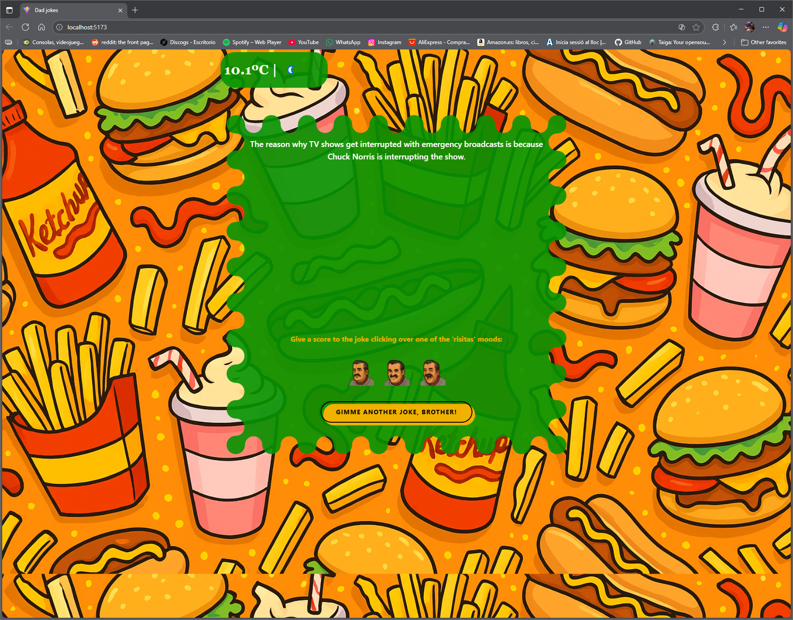
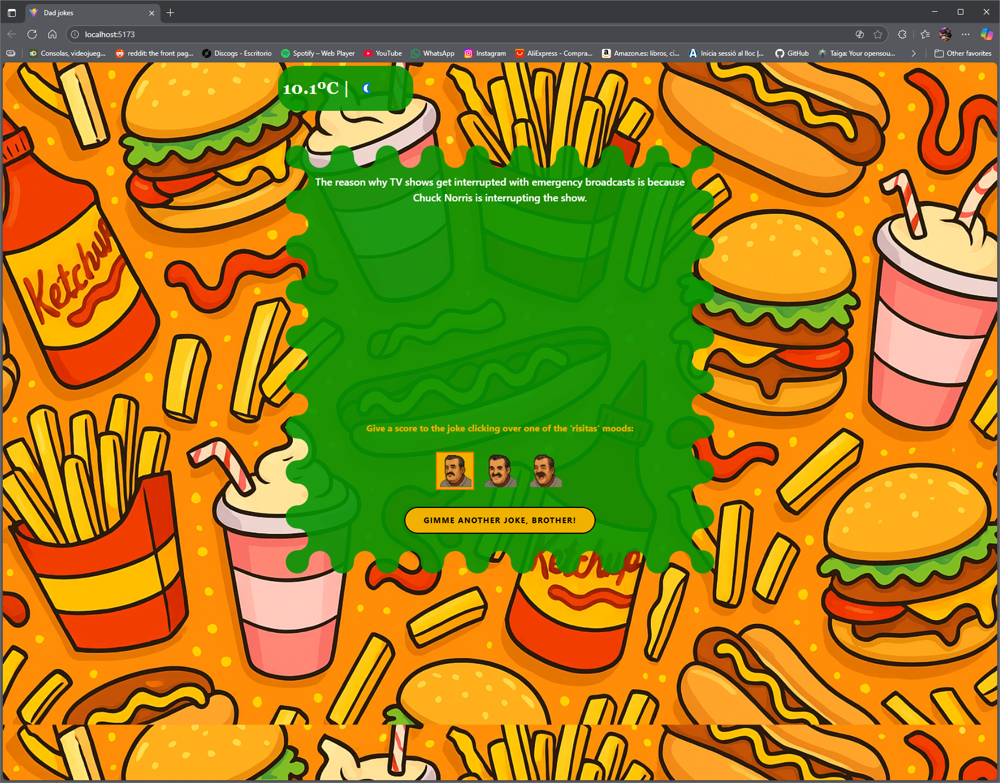
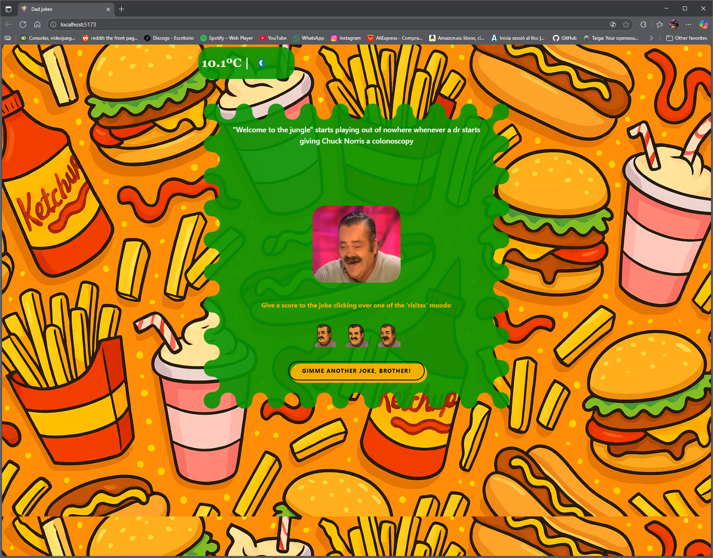
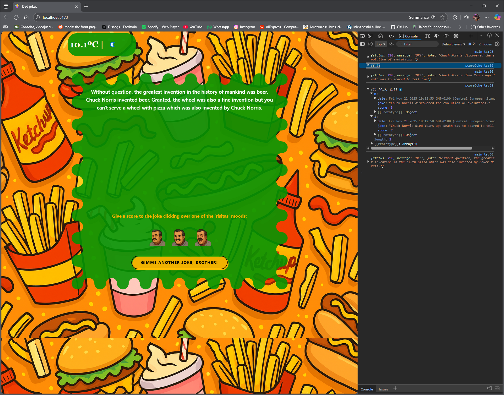

# frontend-shop

[](https://github.com/RichardLitt/standard-readme)


**Random joke fetcher** built with **Tailwind**, **JavaScript** and **TypeScript\*\* , designed with a desktop approach.

---

## Table of Contents

- [Background](#background)
- [Technologies](#technologies)
- [Structure](#structure)
- [Installation](#installation)
- [Features](#features)
- [Usage](#usage)
- [Testing](#testing)
- [Screenshots](#screenshots)
- [API](#api)
- [Maintainers](#maintainers)
- [Contributing](#contributing)
- [License](#license)

---

## Background

This project started as a way to learn TypeScript, API fetching, and to reinforce my small knowledge of testing.

---

## Technologies

- HTML5
- TailWindCSS v4.1.17
- JavaScript ES6
- TypeScript v5.9.3
- Node.js v25.1.0
- Vite v7.2.2
- Vitest v4.0.12

---

## Structure

```text
├── assets/               # Project assets (images, icons, media)
├── node_modules/         # Installed dependencies (auto-generated)
├── src/                  # TypeScript source files
├── tests/                # Test suites (Vitest)
├── index.html            # Main page
├── package-lock.json     # Dependency lockfile (auto-generated)
├── package.json          # Project manifest (dependencies, scripts, metadata)
├── setupTests.d.ts       # Test setup and type definitions
├── tsconfig.json         # TypeScript compiler configuration
├── vite.config.ts        # Vite configuration file
└── README.md             # Project documentation

```

---

## Installation

```text
# Clone the repository
git clone https://github.com/isaacmg-bit/js-basics-Sprint-2.2.git

# Navigate to the project folder

# Launch project
In the terminal:
npm install
npm run dev
Open the localserver that has been created
```

---

## Features

- Random fetch of Dad Jokes or Chuck Norris jokes from two different APIs
- Joke rating system which registers scores in a local storage system, along with the joke and a timestamp
- Actual weather from Barcelona shown in the header
- Responsive Tailwind design
- Unit testing with Vitest
- TypeScript modular architecture

---

## Usage

- Click on the "Gimme another joke, brother!" button to fetch a new random joke
- Click on any of the 'risitas' faces to select a score for the actual joke. Score will be sent as soon as we fetch a new joke.
- The weather 'widget' is not interactive

---

## Testing

- To run the test suite, type `npm run test` while in the project folder

---

## Screenshots







---

## API

This project fetches jokes from **two different public APIs**, allowing users to receive a random **Dad joke** or **Chuck Norris joke**.

### 1. icanhazdadjoke API

The **icanhazdadjoke** API provides random Dad jokes.  
The project retrieves jokes by sending a GET request to:

```
https://icanhazdadjoke.com/
```

The API responds with an object containing:

- A unique joke `id`
- The joke text under the `joke` field
- A status code

### 2. Chuck Norris Jokes API

The **Chuck Norris Jokes API** returns random jokes themed around Chuck Norris.  
The project retrieves jokes by sending a GET request to:

```
https://api.chucknorris.io/jokes/random
```

The API responds with an object containing:

- An icon `icon_url`
- A unique `id`
- An empty string `url`
- The joke text under the `value` field

### 3. Weather API

The **Weather API** returns all the current weather from any city.
The project retrieves the current weather by sending a GET request with the parameters `key` and `q=Barcelona` to:
```
http://api.weatherapi.com/v1
```
The API responds with an object containing, among others:
- `location`, which includes `region`, `country`, `localtime`...
- `current`, which includes `temp_c`, `condition`...

---

## Maintainers

[@Isaac Malagón](https://github.com/isaacmg-bit)

---

## Contributing
```text
1. Fork this repository
2. Create a new branch (`git checkout -b feature/your-feature`)
3. Make your changes and commit (`git commit -m 'Add new feature'`)
4. Push to your branch (`git push origin feature/your-feature`)
5. Create a Pull Request
````

**Pull requests** are welcome.  
If you edit the README, please make sure to follow the  
[standard-readme](https://github.com/RichardLitt/standard-readme) specification.

---

## License

This work is licensed under a [Creative Commons Attribution-NonCommercial 4.0 International License](https://creativecommons.org/licenses/by-nc/4.0/).  
© 2025 Isaac Malagón — Commercial use and redistribution are not allowed without permission.
